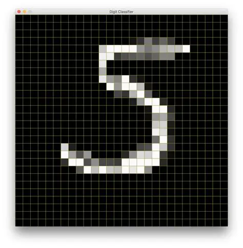
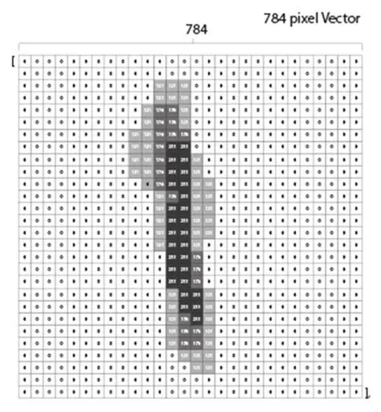
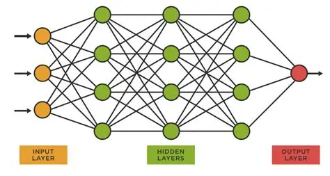
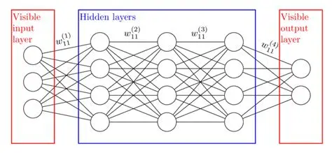
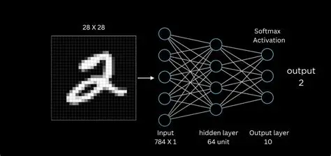

Excellent choice — let’s **visualize the handwriting recognition workflow** so you can see how the PyTorch model transforms digit images step by step.  

---

## Visual Walkthrough

### 1. Input Images (Raw Data)
Each MNIST digit is a **28×28 grayscale image**.  
- **Inputs**: Pixel intensity values (0 = white, 255 = black).  
- Example: A handwritten "5" looks like this:

---

### 2. Flattening into Features
The image is reshaped into a **vector of 784 features**.  
- **Features**: Each pixel becomes one feature.  
- Linear algebra: \( x = [x_1, x_2, ..., x_{784}] \).

---

### 3. First Layer Transformation
The first fully connected layer applies:

$$
h_1 = W_1 \cdot x + b_1
$$

- **Weights**: Matrix $W_1$ scales features.  
- **Bias**: Vector $b_1$ shifts results.  
- Activation (ReLU) introduces non-linearity.

---

### 4. Hidden Layers
Each hidden layer repeats the process:  
- Multiply by weights, add bias, apply activation.  
- This extracts **patterns** like strokes, curves, and digit shapes.

---

### 5. Output Layer
Final layer produces **10 scores** (one per digit).  
- **Parameters**: All weights + biases across layers.  
- The digit with the highest score is chosen as the prediction.

---

## Putting It Together
- **Inputs**: Raw digit images.  
- **Features**: Pixel intensities.  
- **Weights & Biases**: Learned values that transform features into meaningful patterns.  
- **Parameters**: Entire set of weights + biases across layers.  
- **Prediction**: The network outputs the most likely digit.

---

This visualization shows how **linear algebra (matrix multiplication + bias addition)** drives the entire recognition pipeline.  
